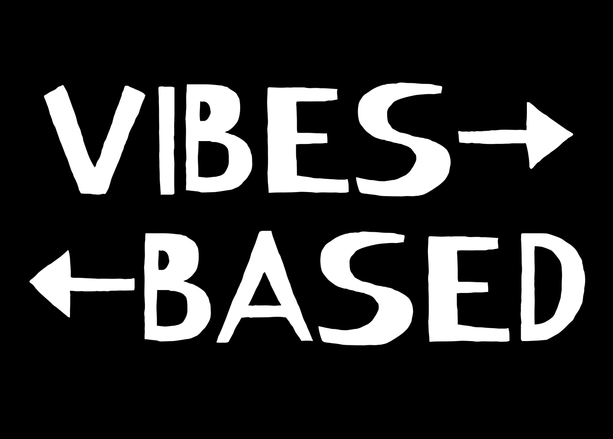

<a id="readme-top"></a>

<!-- PROJECT SHIELDS -->
[![Contributors][contributors-shield]][contributors-url]
[![Forks][forks-shield]][forks-url]
[![Stargazers][stars-shield]][stars-url]
[![Issues][issues-shield]][issues-url]
[![MIT License][license-shield]][license-url]
[![LinkedIn][linkedin-shield]][linkedin-url]

<!-- PROJECT LOGO -->
<br />
<div align="center">
  <a href="https://github.com/othneildrew/Best-README-Template">
    
  </a>

  <h1 align="center">Vibesbased</h1>

  <p align="center">
    A music discovery application based on vibes. 
    <br />
    <a href="https://vibesbased.site"><strong>Go to website »</strong></a>
    <br />
    <br />
    <a href="https://github.com/jcandrews2/vibesbased">See Docs</a>
    &middot;
    <a href="https://github.com/jcandrews2/vibesbased/issues/new?labels=bug&template=bug-report---.md">Report Bug</a>
    &middot;
    <a href="https://github.com/jcandrews2/vibesbased/issues/new?labels=enhancement&template=feature-request---.md">Request Feature</a>
  </p>
</div>


<!-- TABLE OF CONTENTS -->
<details>
  <summary>Table of Contents</summary>
  <ol>
    <li>
      <a href="#about-the-project">About The Project</a>
      <ul>
        <li><a href="#built-with">Built With</a></li>
      </ul>
    </li>
    <li>
      <a href="#getting-started">Getting Started</a>
      <ul>
        <li><a href="#prerequisites">Prerequisites</a></li>
        <li><a href="#installation">Installation</a></li>
      </ul>
    </li>
    <li><a href="#usage">Usage</a></li>
    <li><a href="#license">License</a></li>
    <li><a href="#contact">Contact</a></li>
  </ol>
</details>


<!-- ABOUT THE PROJECT -->
<h2>About The Project</h2>

[![Product Name Screen Shot][product-screenshot]](https://example.com)

Vibesbased is a full-stack music discovery web app that takes in plain-text music requests from users and plays personalized song recommendations by combining a host of APIs from Spotify, LastFM, and OpenAI. Users swipe through animated music cards to like and dislike songs building a vibe-driven portfolio over time.

The project is an attempt to offer a more intuitive and mood-aware way to explore music.

<p align="right">(<a href="#readme-top">back to top</a>)</p>

<h3>Built With</h3>

<h4>APIs & SDKs</h4>
<ul>
  <li>
    <strong>Spotify Web API & Web Playback SDK</strong><br />
    Used to fetch user data and handle music streaming.
  </li>
  <li>
    <strong>Last.fm API</strong><br />
    Pulled songs from endpoints Tag, Track, Album, Artist to recommend.
  </li>
  <li>
    <strong>OpenAI API (Completions endpoint)</strong><br />
    Used to reason for appropriate tags and endpoints given user requests.
  </li>
</ul>

<h4>Technologies</h4>
<ul>
  <li><strong>Frontend:</strong> React, TypeScript, HTML, Tailwind CSS</li>
  <li><strong>Backend:</strong> Java, Spring Boot</li>
  <li><strong>Infrastructure:</strong> Docker, AWS EC2</li>
  <li><strong>Database:</strong> PostgreSQL</li>
</ul>


<p align="right">(<a href="#readme-top">back to top</a>)</p>


<!-- GETTING STARTED -->
## Getting Started

This is an example of how you may give instructions on setting up your project locally.
To get a local copy up and running follow these simple example steps.

### Prerequisites

This is an example of how to list things you need to use the software and how to install them.
* npm
  ```sh
  npm install npm@latest -g
  ```

### Installation

_Below is an example of how you can instruct your audience on installing and setting up your app. This template doesn't rely on any external dependencies or services._

1. Get a free API Key at [https://example.com](https://example.com)
2. Clone the repo
   ```sh
   git clone https://github.com/github_username/repo_name.git
   ```
3. Install NPM packages
   ```sh
   npm install
   ```
4. Enter your API in `config.js`
   ```js
   const API_KEY = 'ENTER YOUR API';
   ```
5. Change git remote url to avoid accidental pushes to base project
   ```sh
   git remote set-url origin github_username/repo_name
   git remote -v # confirm the changes
   ```

<p align="right">(<a href="#readme-top">back to top</a>)</p>


<!-- LICENSE -->
## License

Distributed under the MIT License. See `LICENSE` for more information.

<p align="right">(<a href="#readme-top">back to top</a>)</p>

<!-- CONTACT -->
## Contact

James Andrews - jcandrews2@icloud.com

<p align="right">(<a href="#readme-top">back to top</a>)</p>


<!-- MARKDOWN LINKS & IMAGES -->
[contributors-shield]: https://img.shields.io/github/contributors/jcandrews2/vibesbased.svg?style=for-the-badge
[contributors-url]: https://github.com/jcandrews2/vibesbased/graphs/contributors

[forks-shield]: https://img.shields.io/github/forks/jcandrews2/vibesbased.svg?style=for-the-badge
[forks-url]: https://github.com/jcandrews2/vibesbased/network/members

[stars-shield]: https://img.shields.io/github/stars/jcandrews2/vibesbased.svg?style=for-the-badge
[stars-url]: https://github.com/jcandrews2/vibesbased/stargazers

[issues-shield]: https://img.shields.io/github/issues/jcandrews2/vibesbased.svg?style=for-the-badge
[issues-url]: https://github.com/jcandrews2/vibesbased/issues

[license-shield]: https://img.shields.io/github/license/jcandrews2/vibesbased.svg?style=for-the-badge
[license-url]: https://github.com/jcandrews2/vibesbased/blob/main/LICENSE

[linkedin-shield]: https://img.shields.io/badge/-LinkedIn-black.svg?style=for-the-badge&logo=linkedin&colorB=555
[linkedin-url]: https://linkedin.com/in/jcandrews2

[product-screenshot]: images/vibesbased-front-page.jpg
